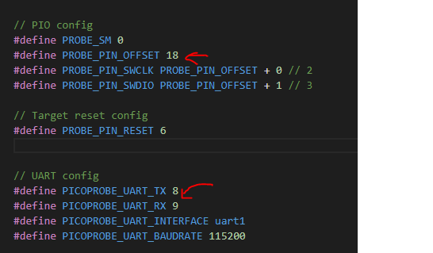

# ozk-picoprobe
debug tool for raspery pi pico rp2040 mcu, changed original picoprobe tool in swd clk and swdio pinout 

## Installation

Use the pico cscode build manager for platformio [pip](https://github.com/Wiz-IO/wizio-pico) to install .

```
PIO Home > Platforms > Advanced Installation
paste https://github.com/Wiz-IO/wizio-pico
INSTALL
```

## Usage
change ´src/picoprobe_config.h´ pins




## Contributing
Pull requests are welcome. For major changes, please open an issue first to discuss what you would like to change.

Please make sure to update tests as appropriate.

## License
[MIT](https://choosealicense.com/licenses/mit/)

